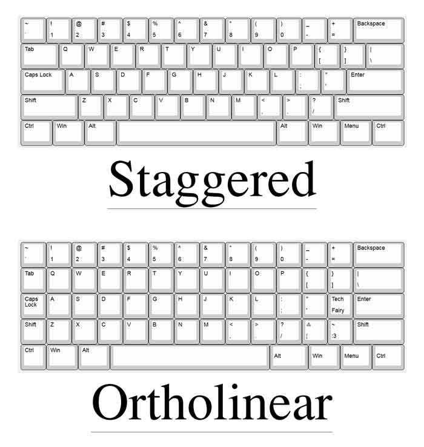

> This repository will be used to document the making of my first custom keyboard. 

> [!IMPORTANT]
> This isn't a guide (yet) and it's still being updated. I haven't finished the keyboard yet, and this is just a draft. 

<center>
  <figure>
    <!-- TODO: Add picture of final result -->
    
    <figcaption>
      <b>Figure 1</b>: This is my keyboard now that it's done!
    </figcaption>
  </figure> 
</center>

# My First Keyboard
So this the process of me documenting the journey of me making **M**y **F**irst keyboard. Or as I will call it, the MF keyboard. Shout out to [@RajuBuddharaju](https://github.com/RajuBuddharaju/) for helping me realise this keyboard. He has been amazing, and I wouldn't have been able to build anything like this without him.

**Table of Contents**
- [My First Keyboard](#my-first-keyboard)
  - [Step 1: Designing the KeyBoard](#step-1-designing-the-keyboard)
    - [Ergogen](#ergogen)
  - [Step 2: Getting the Parts](#step-2-getting-the-parts)
  - [Step 3: Building the Keyboard](#step-3-building-the-keyboard)
  - [Step 4: Programming the Keyboard](#step-4-programming-the-keyboard)
    - [Layout](#layout)
    - [Layers](#layers)
      - [Alphabet Layer ](#alphabet-layer-)
  - [Step 5: Ricing](#step-5-ricing)

## Step 1: Designing the KeyBoard
So the first step to making a custom keyboard is designing the layout. You could go for any of the [standard layouts](https://en.wikipedia.org/wiki/Keyboard_layout) like 100%, 80%, or even 60% keyboards. But those are first of all, no fun, but also very silly. You're hands aren't made for keyboards like that. Your fingers go straight up or down.

So that's why we'll be using called [an ortholinear keyboard](https://www.howtogeek.com/70291/what-is-an-ortholinear-keyboard-and-should-you-use-one/). An ortholinear keyboard is a type of keyboard where the keys are arranged in a straight grid rather than the staggered layout of traditional keyboards. This design allows for more efficient typing as it keeps your hands closer to the home row, potentially reducing finger movement and increasing typing speed.

<center>
  <figure>
    <!-- TODO: Add picture of final result -->
    
    <figcaption>
      <b>Figure 2</b>: the difference a normal keyboard and an ortholinear keyboard.
    </figcaption>
  </figure> 
</center>


### Ergogen
If you're making your own keyboard, design a keyboard for your hands, don't try it the other way around. Not how biology works. So that's what I did! there's a special little community called [r/ErgoMechKeyboards](https://www.reddit.com/r/ErgoMechKeyboards). Who as you guessed it, love Ergonomic Mechanical Keyboards. Who post tons and tons of resources to use. One of these resources they mentioned is called [Ergogen](https://ergogen.cache.works/) which allows you to design your own keyboards using YAML and then export it to, whatever format honestly. There's also an [amazing guide](https://flatfootfox.com/ergogen-part1-units-points/) that goes through this entire process in case you're here to reproduce this.

So that's what you do, you try and put your hands on the screen awkwardly and then get the measurements just right. I was lucky, and mine lined up almost perfectly. So I didn't change much. I did add one key to the pinky side of the keyboard to add that one extra key which shouldn't be too hard to reach. 

<center>
  <figure>
    <!-- TODO: Add picture of final result -->
    
    <figcaption>
      <b>Figure 2</b>: This is the final result of what the keyboard should look like. The file used to make this is also in this repository! It's <a href="./ergogen/config.yaml">this file</a>.
    </figcaption>
  </figure> 
</center>

Then you chose your switch types. I wanted to go for MX-switches as they are the default. However, they're tall. This results in the keyboard only being comfortable when you use an wrist rest, and this, defeats the point. So, I went for `choc` switches. They're the lower variant of MX-switches, making them objectively ergonomically better without a wrist rest.

When you're finalised that, you export it, and move on to the next step.

## Step 2: Getting the Parts
Then when you've designed you're keyboard to the way you want it, you're ready for the next step. First, you've gotta order the parts. This includes, but isn't limited to:
- a fair bit of (choc) switches and stabilisers
- the same amount (fitting) key caps;
- a lot of diodes;
- a micro controller;
- and finally your custom PCB.

The last one is the most interesting as the others are just up to personal taste, or whatever is cheapest at the time of ordering. So who does one make a custom PCB? Well, remember [that file](./ergogen.layout.yaml) we were talking about for designing your keyboard? This is why it's useful. So what you're gonna do is export it and turn it into a PCB. Which you can then order.

## Step 3: Building the Keyboard
This is the most technically challenged part as it requires you to solder. Since you've exported the PCB you can now take a look to see where all the diodes need to be. Once you've soldered all of them you can do the sockets, and then the micro controller. Then you should be done with soldering!

You can now add your switches, and key caps. Afterwards, you should be all set!

## Step 4: Programming the Keyboard
This is in my opinion the most interesting step, as this is the most customizable one. You can make things any way, shape, or size you'd like. You can make as many layers or layouts as you'd like, and reflash it whenever you've found something else that tickles your fancy.

### Layout 
First you start with designing the layout. I went for [colemak](https://colemak.com/), but you can go for whatever you want. I chose it because it's designed for making your poor fingers travel as less as possible. There are a couple of layouts that work like this, for example [Dvorak](https://en.wikipedia.org/wiki/Dvorak_keyboard_layout). However I didn't chose it because it's designed for using your fingers in an alternating motion and my brain just doesn't work that way. It works in bursts, which works better for the rolling motion used in Colemak.

The reason I wanted to use a new layout that wasn't QWERTY is because Colemak is more ergonomic as your fingers don't have to travel as often. Meaning you're fingers are doing less work. It supposedly leads to less injuries.

### Layers
I was thinking of a couple of layers:
- an alphabet;
- numbers and symbols;
- and finally a navigation layer

#### Alphabet Layer <!-- TODO: update this once you're done! -->
This is so far still a concept, and a work in progress
```
    Q W F P G   J L U Y ;  
  ⎋ A R S T D   H N E I O ⏎
    Z X C V B   K M , . /
        ⌦ ␣       ⇥ ⌫

Escape:     ⎋
Tab:        ⇥
Enter:      ⏎
Backspace:  ⌫
Delete:     ⌦
```

## Step 5: Ricing
To rice this keyboard you could do many things, like add LEDs, or even RBG, cool key caps. The most important thing however, is a case. Not only does it improve the looks, as it hides the soldering. It also prevents damage to either the PCB, or the desk, as solder joints could scratch the surface they are laying on. 

<!-- TODO: Look over this paragraph and rewrite it when you've reached this step -->
This should be pretty easy as Ergogen allows you to get a basic shape of the keyboard. Then all you have to do, is make a 3D model of your keyboard, and bam. You've got a case when you print it out. That's what I'm planning on doing. As I haven't actually reached this step yet.

Once you've riced you're keyboard and you're ready to rock it, you can give it a type test, and then enjoy it! :D
